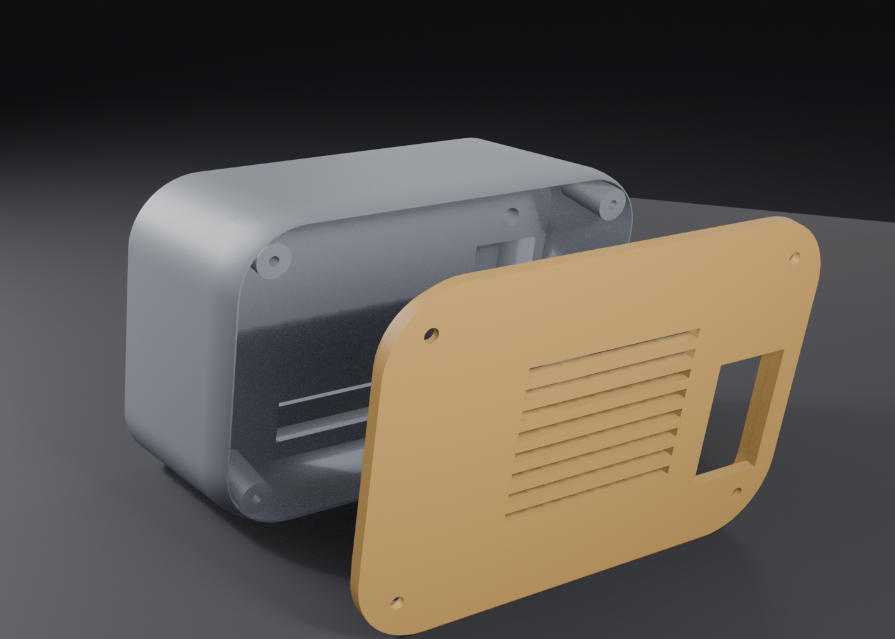
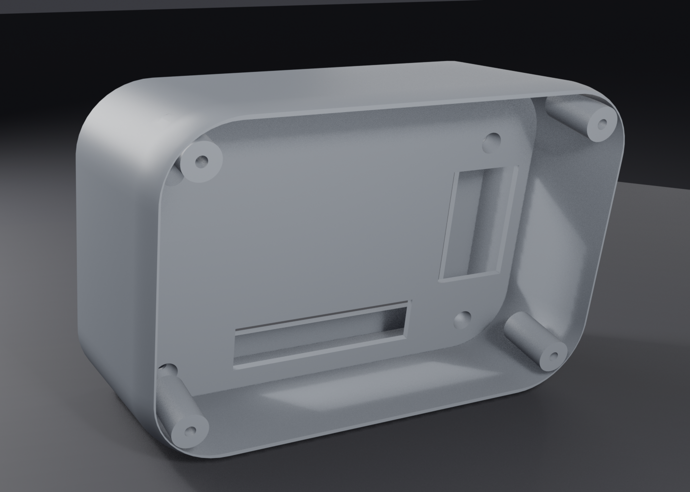

# BitcoinClock Enclosure — User Manual

End-user guide for printing and assembling the BitcoinClock case for the
**Guition JC3248W535** board (ESP32-S3 + 3.5" touch display).

Designed by **silexperience**.

---

## 1. What you need

### Common to every version

- The **Guition JC3248W535** board with its **4 original corner screws**
- A 3D printer, PLA or PETG filament
- USB-C cable (power / programming)
- Small Phillips screwdriver

### Version XL (recommended) additionally

- Small speaker (8 Ω, JST 1.25 mm 2-pin — the board has a `Speak` connector)
- LiPo battery up to **2000 mAh**, JST 1.25 mm 2-pin (`BAT` connector)
- **4× M3 × 8–10 mm self-tapping screws** (rear cover ↔ body)
- Foam double-sided tape (to secure speaker and battery)

### Version 2 (deep) additionally

- Small speaker (e.g. 8 Ω with JST 1.25 mm 2-pin plug — the board has a
  dedicated `Speak` connector)
- LiPo battery up to **2000 mAh** with JST 1.25 mm 2-pin plug (the board has a
  charge circuit and a `BAT` connector)
- **4× M3 × 8–10 mm self-tapping screws** (front frame ↔ rear shell junction)
- Foam double-sided tape or hot glue (to secure speaker and battery)

> ⚠️ **Safety — LiPo battery:** use a protected cell from a reputable brand,
> respect polarity, never pierce or crush the battery, and do not leave the
> device charging unattended for long periods.

> ⚠️ **The 4 corner screws also hold the screen frame.** Unscrew them gently,
> one at a time, while holding the screen in place.

---

## 2. Firmware (do this first — easiest before assembly)

1. Install the ESP32 Arduino core **2.0.14** and `GFX Library for Arduino`
   **v1.4.9 exactly** (+ ArduinoJson v7).
2. Compile & upload (adapt the port):

```bash
cd firmware/bitcoin-block-clock
arduino-cli compile --fqbn "esp32:esp32:esp32s3:FlashSize=16M,PSRAM=opi,PartitionScheme=huge_app,CPUFreq=240,USBMode=hwcdc,CDCOnBoot=cdc" .
arduino-cli upload --fqbn "esp32:esp32:esp32s3" -p COM42 .
```

3. **Press RESET physically after flashing** (the board can stay in download
   mode while the COM port is held).
4. First boot: join the **`BlockClock-Setup`** WiFi AP (password `12345678`),
   enter your WiFi credentials → the clock reboots on your network as
   `http://blockclock.local`.

> The case does not block reflashing: on v2, remove the rear shell (4× M3)
> to reach the board; the boot/reset buttons are inside — flash **before**
> final assembly if you can.

## 3. Printing

### Version XL — body + rear cover (recommended)

Print **one** body finish plus the cover.

| Body finish | File | Material |
|---|---|---|
| Smooth | `case/boitier_xl_corps.stl` | 64.1 cm³ |
| Longitudinal flutes | `case/boitier_xl_corps_cannelures.stl` | 62.4 cm³ |
| Staggered blocks | `case/boitier_xl_corps_blocs.stl` | 61.2 cm³ |
| **Genesis block hash** | `case/boitier_xl_corps_genesis.stl` | 67.7 cm³ |

| Setting | Body | Rear cover |
|---|---|---|
| File | one of the four above | `case/boitier_xl_capot.stl` |
| Orientation | As supplied — **flat underside on the bed** | As supplied — flat |
| Supports | **None** | **None** |
| Bed footprint | 116 × 71.8 × 80.2 mm | 116 × 82 × 6.9 mm |
| Walls | 3–4 perimeters | 3–4 perimeters |
| Infill | 20–25 % | 25–30 % (it carries the screws) |
| Layer height | 0.2 mm | 0.2 mm |

> 💡 The genesis finish is **in relief**, so it adds 2.7 mm to the overall width
> (118.7 mm instead of 116). Its pads are 1.2 mm proud — below 0.2 mm layers the
> pattern loses definition; raise `relief` in `_hash_relief()` if it prints soft.

> The body's divider prints **vertically** in this orientation, which is exactly
> why no supports are needed. Do not re-orient it in the slicer.

Regenerate any variant in about 30 seconds:

```bash
blender --background --python case/build_v1xl_blender.py            # smooth
blender --background --python case/build_v1xl_blender.py -- --genesis
```

### Version 1 — compact (`case/boitier_bitcoinclock.stl`)

| Setting | Value |
|---|---|
| Orientation | As supplied — front face flat on the bed |
| Supports | **Yes** — inside the inner cavity only (tree/organic recommended); marks stay hidden inside |
| Walls | 3–4 perimeters |
| Infill | 20–25 % |
| Layer height | 0.2 mm (0.16 mm for a smoother dome) |
| Material | ~35–45 g |

### Version 2 — deep (`case/boitier_deep_avant.stl` + `case/boitier_deep_arriere.stl`)

| Setting | Front frame | Rear shell |
|---|---|---|
| Orientation | As supplied — rear rim on the bed, opening up | As supplied — back face on the bed, opening up |
| Supports | **None** | **None** |
| Walls | 3–4 perimeters | 3–4 perimeters |
| Infill | 20–25 % | 15–25 % |
| Print time (approx.) | 3–4 h | 20–30 h (~158 mm tall) |

> 💡 15 cm is generous for a speaker + battery. For a shorter print, edit
> `TUBE_T_END` in `build_case_deep.py` (80–100 mm is plenty) and regenerate.

All STLs are verified watertight/manifold — your slicer should import them
with **zero repair**.

---

## 4. Assembly — Version XL

The whole design follows from one fact: **the 4 original screws go in from
behind**. That is why the body is open at the back — sealed in a single piece
they would be unreachable.

1. **Board into the front pocket**, screen facing out. Its four rear bosses drop
   onto the four posts standing on the divider; the board should sit flush with
   the front face. If the screen stands proud, stop and read the note below.
2. **Fit the 4 original screws** through the wells, working from the open back.
   The heads seat in the Ø6 mm counterbores. **Do not over-tighten** — the well
   floor is 1 mm.
3. **Speaker and battery** into the rear compartment (31 mm deep), fixed with
   foam tape. Pass their plugs through the **divider slot** (50 × 12 mm) and
   connect them to `Speak` and `BAT`.
4. **Thread the USB-C cable** through the straight passage (20 × 32 mm) that
   crosses the divider and the cover, and plug it into the board's rear-facing
   connector.
5. **Close with the cover**, 4 × M3. Its lip centres it; the grille goes at the
   bottom, over the speaker.

> ⚠️ **If the screen stands proud of the front face**, the board's rear bosses
> are taller than the 12 mm this model assumes. Measure them with calipers, set
> `BOSS_H` in `case/bcc/params.py`, and regenerate — the screen position follows
> that single value.




---

## 5. Assembly — Version 1

1. Unscrew the 4 corner screws of the board (one at a time, hold the screen).
2. Seat the board in the front pocket, **screen facing out**, USB-C on the
   **left**.
3. Refit the 4 original screws through the rear wells — the heads seat into
   the Ø6 mm counterbores. **Do not over-tighten** (1 mm well floor).
   If a screw feels too short, replace it with an M2.5/M3 screw 2–3 mm longer.
4. Plug USB-C through the side cutout.

> ⚠️ **Two known defects in v1 — prefer the XL.** This version assumes a flat
> board back, so the rear bosses hold the board up and the screen stands ~12 mm
> proud of the front face. Its USB-C cutout is on the side, whereas the board's
> connector is a right-angle part facing rearward. Both are fixed in the XL.


---

## 6. Assembly — Version 2 (deep)

1. **Mount the board on the front frame** exactly as in v1 (steps 1–3 above).
   The screw wells are accessible from the rear of the frame while the shell
   is off.
2. **Connect the speaker** to the `Speak` JST connector (bottom edge) and the
   **battery** to the `BAT` JST connector (top area).
3. **Route the plugs** through the wire slots of the frame: bottom slot for
   speaker/IO, top slot for the battery.
4. Stick the **speaker** behind the rear grille and the **battery** inside the
   shell with foam tape or hot glue.
5. **Slide the rear shell** over the frame's boss until it seats on the
   shoulder, then fasten the **4× M3 screws** on the sides (Ø2.5 mm pilots are
   pre-drilled).
6. Plug USB-C on the left side of the frame.


---

## 7. Using the clock

- **Power/charging:** plug USB-C on the left side. The board charges the
  battery automatically when present.
- **Battery switch:** the board's battery switch (rear side) becomes
  inaccessible once assembled — leave it **ON**, or open the shell (4× M3) to
  reach it. **Note:** a short press on this button is also required to *start*
  the board on battery (the power-management IC keeps the 5 V output off until
  then).
- **Battery gauge:** the header battery icon shows the % inside it and
  **blinks while charging**.
- **Voice:** natural voice via **Google Translate TTS** (MP3 fetched and
  decoded on-device, no API key) announcing *"New block, \<pool\>"*. Falls
  back to the offline SAM robotic voice if the network fetch fails. Try it:
  `http://blockclock.local/say?t=Hello`. Set `TTS_LANG "fr"` for French
  announcements (*"Nouveau bloc, \<pool\>"*), or `TTS_GOOGLE 0` for SAM-only.
- **Sound — volume & mute:** tap the **speaker icon in the header** (left of
  the WiFi dots) to cycle **100 % → 60 % → 30 % → mute**, saved in flash
  (applies to bells *and* the SAM voice). Night mode (23:00–07:00) silences
  event sounds; UI beeps remain.
- **Boot/Reset buttons:** also inside the case — open the shell to reprogram
  the board, or flash it before final assembly.
- The case leans back 12° with a full-length flat base: stable on any desk.

---

## 8. Troubleshooting

| Problem | Fix |
|---|---|
| Board doesn't seat fully | Check for filament blobs in the pocket corners; the pocket has +0.3 mm/side clearance |
| Original screw feels too short | Well floor is 1 mm by design; use an M2.5/M3 screw 2–3 mm longer |
| Screw holes don't line up | Pattern is 84.5 × 52.0 mm measured from photos — verify yours with calipers and adjust `HOLE_DX`/`HOLE_DY` in the build script |
| Screen stands proud of the front face (XL) | The board's rear bosses are taller than the assumed 12 mm — measure and set `BOSS_H` in `case/bcc/params.py`, then regenerate |
| USB cable won't reach the connector (XL) | The passage is 20 × 32 mm and deliberately oversized; if the connector still misses it, adjust `USB_PASS_X`/`USB_PASS_Y` |
| Rear cover won't seat (XL) | The lip has 0.35 mm clearance per side — clear any elephant foot on the body's rear rim |
| USB plug doesn't fit (v1) | Side cutout is 11 × 5.2 mm; use a slim plug or slightly enlarge `USB_W`/`USB_H` |
| Case rocks (v1) | Base is stability-checked; ensure the bottom face printed flat (no elephant foot) — sand lightly if needed |
| Speaker sounds muffled | Make sure it sits against the grille slots, not against a solid wall |

## 9. Care

- Keep away from heat sources (>60 °C softens PLA).
- If the battery is installed, charge at least every few months.
- Clean with a dry cloth; no solvents on the printed parts.

---

*BitcoinClock enclosure — designed by **silexperience**.*
