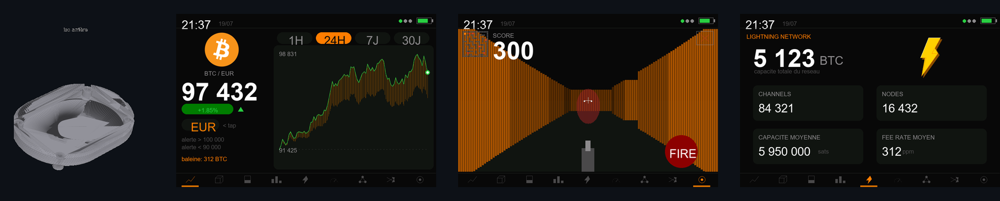

<div align="center">

# ⚡ BITCOIN BLOCK CLOCK ⚡

### The ultimate Bitcoin desk companion
**Live price · On-chain · Pools war · Lightning stats · Local AI · Doom raycaster**
*on a 3.5" touch display, in a custom 3D-printed shell*




[](https://github.com/Silexperience210/bitcoin-block-clock/stargazers)

</div>

---

## 🖥️ Firmware — 9 pages, 100 % responsive

**FreeRTOS architecture**: `netTask` fetches all HTTP off the UI thread,
`sndTask` plays sound from a queue — the touch never blocks. WiFi config via
web portal (`BlockClock-Setup`), mDNS `blockclock.local`, night mode,
watchdog, NTP. **Zero credentials in the code.**

| Page | What you get |
|---|---|
| 💹 **PRICE** | EUR/USD/CHF live price with smooth animated digits, chart with 4 timeframes & touch cursor, price alerts |
| ⛓️ **ON-CHAIN** | Block height + timer, fees ×4, difficulty, halving countdown, **Whale Watch**, bell *DONG* on every new block |
| 🗣️ **VOICE** | Natural voice (Google Translate TTS, MP3 decoded on-device via ESP8266Audio) announcing *"New block"* + the mining pool — SAM robotic voice as offline fallback. Test: `http://blockclock.local/say?t=Hello` |
| 🧊 **CUBE** | Mempool as particle art — a chain drags each mined block away |
| 🏁 **POOLS WAR** | Animated race of mining pools over the week (mempool.space) |
| ⚡ **LIGHTNING** | Network capacity, channels, nodes, average fees |
| 📡 **NODE** | Fear & Greed gauge + your Umbrel node status |
| 🧠 **LOCAL AI** | 100 % on-device: next-block Poisson model + P(1/5/10 min), fee trend regression, weekly fee cycles learned live (NVS) |
| 📊 **SIGNALS** | 1D vs 1W trend divergence, Bollinger squeeze, technical score, z-score anomaly alarms |
| 👾 **BTC DOOM** | Wolfenstein-style raycaster with **dual multi-touch joysticks** (move + strafe / look). Hunt **Saylor** (tank, laser eyes), **Trump** (fast, blond), **Lagarde** (shoots rate hikes), dodge her projectiles, read the wall slogans — HODL, STACK SATS, FIX THE MONEY. Kill popups, voice taunts, waves. |

### 📸 Screens — faithful mockups, straight from the draw code

| | | |
|---|---|---|
|  |  |  |
| **PRICE** | **ON-CHAIN** | **CUBE** |
|  |  |  |
| **POOLS WAR** | **LIGHTNING** | **NODE** |
|  |  |  |
| **LOCAL AI** | **SIGNALS** | **BTC DOOM** |

New block flash (every page except CUBE):


*Mockups rendered by [`firmware/tools/mockup_screens.py`](firmware/tools/mockup_screens.py),
which replays the actual drawing functions (same RGB565 palette, same
coordinates, same raycaster) with example data.*
*Dev notes (FR): [`firmware/PROJET-NOTES.md`](firmware/PROJET-NOTES.md).*

---

## 🧊 Enclosure — parametric & 3D-printed

| | **v1 — Compact** | **v2 — Deep (~15 cm)** |
|---|---|---|
| Look | Rounded oblong pebble | Mini retro TV / Echo Show wedge |
| Depth | 20 mm | ~147 mm |
| Fits | Board only | Board + speaker + 2000 mAh battery |
| Files | `case/boitier_bitcoinclock.stl` | `case/boitier_deep_avant.stl` + `case/boitier_deep_arriere.stl` |

**Shared**: 12° desk tilt (stability-checked) · mounted with the **4 original
board screws** (84.5 × 52.0 mm pattern) · USB-C cutout · verified
watertight/manifold meshes — zero repair in the slicer.

📖 **Printing & assembly: [MANUAL.md](MANUAL.md)** · 🇫🇷 **[README.fr.md](README.fr.md)**


---

## 🔧 Hardware

- **Guition JC3248W535** — ESP32-S3 N16R8 (16 MB flash, 8 MB PSRAM OPI),
  3.5" IPS 320×480 AXS15231B (QSPI), capacitive touch (I2C `0x3B`), NS4168
  I2S amp (external speaker, JST), LiPo charge circuit + voltage sense, SD slot
- Optional (v2): 8 Ω speaker (JST 1.25 2P), LiPo battery up to **2000 mAh**


---

## 🚀 Build & flash

Requires ESP32 Arduino core **2.0.14**, `GFX Library for Arduino`
**v1.4.9 exactly**, ArduinoJson v7, **ESP8266Audio v1.9.7** (not 2.x — it
needs ESP-IDF 5.x).

```bash
cd firmware/bitcoin-block-clock
arduino-cli compile --fqbn "esp32:esp32:esp32s3:FlashSize=16M,PSRAM=opi,PartitionScheme=huge_app,CPUFreq=240,USBMode=hwcdc,CDCOnBoot=cdc" .
arduino-cli upload  --fqbn "esp32:esp32:esp32s3" -p COM42 .
```

Then **press RESET physically**. First boot: join the `BlockClock-Setup` AP
(password `12345678`), enter your WiFi — the clock appears as
`http://blockclock.local`.

<details>
<summary><b>📂 Repository layout</b> (click to expand)</summary>

```
├── firmware/
│   ├── bitcoin-block-clock/      the sketch (Arduino IDE compatible)
│   │   ├── bitcoin-block-clock.ino
│   │   ├── btc_logo.h            RGB565 logo (from CoinGecko asset)
│   │   ├── smooth_font.h         anti-aliased digits (4 bpp alpha)
│   │   ├── trend_model.h         ML experiment — rejected, see notes
│   │   └── btc_logo_src.png
│   ├── tools/                    asset & mockup generators
│   └── PROJET-NOTES.md           dev documentation (FR)
├── case/                         STLs + parametric Python sources
├── images/                       renders, banner & screen mockups
├── ref/                          manufacturer photos & references
├── MANUAL.md                     end-user manual (EN)
└── README.fr.md                  documentation en français
```

</details>

<details>
<summary><b>🧪 Regenerate the 3D case</b></summary>

```bash
python -m venv .venv
.venv/Scripts/pip install trimesh manifold3d numpy scipy shapely networkx rtree matplotlib pillow mapbox_earcut
.venv/Scripts/python case/build_case.py        # v1 compact
.venv/Scripts/python case/build_case_deep.py   # v2 deep
```

Key parameters at the top of each script: board dimensions, screw pattern,
tilt angle, depth, USB cutout, speaker grille…

</details>

---

## 🙏 Credits

- Board measurements from manufacturer photos via
  [GthiN89/JC3248W535EN](https://github.com/GthiN89/JC3248W535EN)
- Board info: [atomic14 — Guition JC3248W535](https://www.atomic14.com/esp32/boards/guition-jc3248w535/)
- Community case: [Thingiverse 7127557](https://www.thingiverse.com/thing:7127557)
- APIs: CoinGecko · mempool.space · alternative.me (Fear & Greed)

<div align="center">

---
**⚡ Bitcoin Block Clock — firmware & enclosure designed with 🧡 by [silexperience](https://github.com/Silexperience210) ⚡**

</div>
