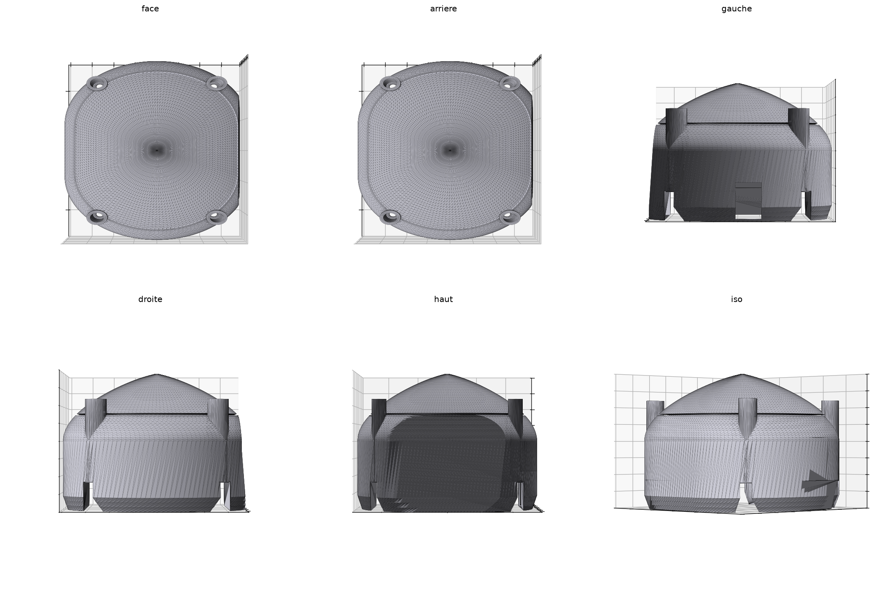

# BitcoinClock — 3D-Printed Enclosure for Guition JC3248W535

A parametric, 3D-printable enclosure for the **BitcoinClock** project, built
around the **Guition JC3248W535** (ESP32-S3 + 3.5" 480×320 capacitive touch
display). The bare screen forms the front face; the case wraps behind it like
an Alexa-style rounded pebble — or, in the deep version, like a mini retro TV
with room for a **speaker** and a **2000 mAh battery** inside.

Designed by **silexperience**.


## Two versions

| | **v1 — Compact** | **v2 — Deep (~15 cm)** |
|---|---|---|
| Look | Rounded oblong pebble | Mini retro TV / Echo Show wedge |
| Depth | 20 mm | ~147 mm |
| Fits | Board only | Board + speaker + 2000 mAh battery |
| Parts | 1 | 2 (front frame + rear shell) |
| Mounting | 4 original board screws | 4 original board screws + 4× M3 join screws |
| Speaker grille | — | Yes (rear face) |
| Files | `boitier_bitcoinclock.stl` | `boitier_deep_avant.stl`, `boitier_deep_arriere.stl` |

Both versions share:

- **12° backward tilt** for desk reading, with a flat, stability-checked base
- Exact fit for the **94.5 × 62.0 mm** board (measured from manufacturer photos)
- Screw wells for the **4 original corner screws** (pattern 84.5 × 52.0 mm)
- **USB-C cutout** on the left side
- Verified watertight, manifold meshes — no repair needed in the slicer




## The board

Guition JC3248W535 — ESP32-S3 (16 MB flash, 8 MB PSRAM), 3.5" 480×320 IPS
display with capacitive touch, USB-C, LiPo charge circuit, speaker output.


## Repository layout

```
├── boitier_bitcoinclock.stl                 v1 case (print orientation)
├── boitier_bitcoinclock_display_orientation.stl
├── boitier_deep_avant.stl                   v2 front frame (print orientation)
├── boitier_deep_arriere.stl                 v2 rear shell (print orientation)
├── boitier_deep_*_display.stl               v2 parts, posed orientation
├── build_case.py                            v1 parametric source
├── build_case_deep.py                       v2 parametric source
├── render_preview.py                        preview renderer
├── MANUAL.md                                end-user manual (print & assembly)
├── README.fr.md                             documentation en français
├── images/                                  renders & section views
└── ref/                                     manufacturer photos & references
```

## Quick start

1. Print the STL for your version — settings in **[MANUAL.md](MANUAL.md)**.
2. Seat the board in the front pocket, screen facing out.
3. Refit the 4 original screws through the rear wells.
4. (v2) Connect speaker + battery, slide the rear shell on, fasten 4× M3.
5. Plug USB-C on the left. Done.

## Regenerating / customizing

Everything is parametric (Python + trimesh + manifold3d):

```bash
python -m venv .venv
.venv/Scripts/pip install trimesh manifold3d numpy scipy shapely networkx rtree matplotlib pillow mapbox_earcut
.venv/Scripts/python build_case.py        # v1 compact
.venv/Scripts/python build_case_deep.py   # v2 deep
```

Key parameters at the top of each script: board dimensions, screw pattern
(`HOLE_DX`/`HOLE_DY`), tilt angle (`TILT_DEG`), depth (`DOME_Z` v1 /
`TUBE_T_END` v2), USB cutout, speaker grille, and more.

## Credits & references

- Board measurements from manufacturer photos via
  [GthiN89/JC3248W535EN](https://github.com/GthiN89/JC3248W535EN)
  (94.5 × 62.0 mm outline, 73.4 × 49.0 mm active area)
- Community reference case:
  [Standalone Case JC3248W535C — Thingiverse 7127557](https://www.thingiverse.com/thing:7127557)
- Board info: [atomic14 — Guition JC3248W535](https://www.atomic14.com/esp32/boards/guition-jc3248w535/)

---

*BitcoinClock enclosure — designed by **silexperience**.*
