# Bitcoin Block Clock

A showcase **Bitcoin desk clock** built on the **Guition JC3248W535**
(ESP32-S3 N16R8 + 3.5" 480×320 capacitive touch display) — live price,
charts, blocks, mempool, sound alerts, games — wrapped in a custom
**3D-printed enclosure** (compact pebble or deep ~15 cm version with speaker
and battery).

Designed by **silexperience**.

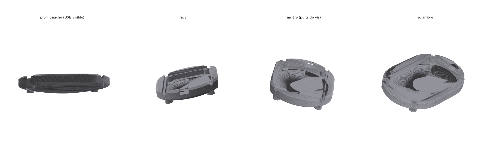

## What's inside

### 🖥️ Firmware (`firmware/`) — V4, ~1700 lines, Arduino/ESP32

**9 pages** (swipe + tab bar): **PRICE · ON-CHAIN · CUBE · POOLS WAR ·
LIGHTNING · NODE · LOCAL AI · SIGNALS · BTC DOOM**

- **FreeRTOS architecture** — `netTask` fetches all HTTP off the UI thread
  (touch always responsive), `sndTask` plays notes from a queue (non-blocking)
- **Price** EUR/USD/CHF + smooth animated digits + chart with 4 timeframes
  and touch cursor (CoinGecko)
- **ON-CHAIN**: block height + timer, fees, difficulty, halving countdown,
  whale watch (>50 BTC), **bell DONG on every new block**
- **CUBE**: mempool particle art — a chain drags each mined block away
- **POOLS WAR**: animated race of mining pools (1 week, mempool.space)
- **LIGHTNING**: network capacity, channels, nodes, fees
- **LOCAL AI** (100% on-device): next-block Poisson model + P(1/5/10 min),
  fee trend regression, weekly fee cycles learned continuously (NVS)
- **SIGNALS**: 1D vs 1W trend divergence, Bollinger squeeze, technical score,
  z-score anomalies with sound alarm
- **BTC DOOM**: mini Wolfenstein-style raycaster — demons hunt you, FIRE
  button, hitscan, score, minimap. Yes, really.
- Price alerts via web page (NVS), WiFi config **web portal**
  (`BlockClock-Setup`), mDNS `blockclock.local`, night mode, WiFi watchdog,
  NTP — **no credentials in the code** (all set via the portal)
- Dev notes (FR): [`firmware/PROJET-NOTES.md`](firmware/PROJET-NOTES.md) —
  hardware pinout, pitfalls, roadmap

#### Screens — faithful mockups (rendered from the actual draw code)

| | | |
|---|---|---|
| 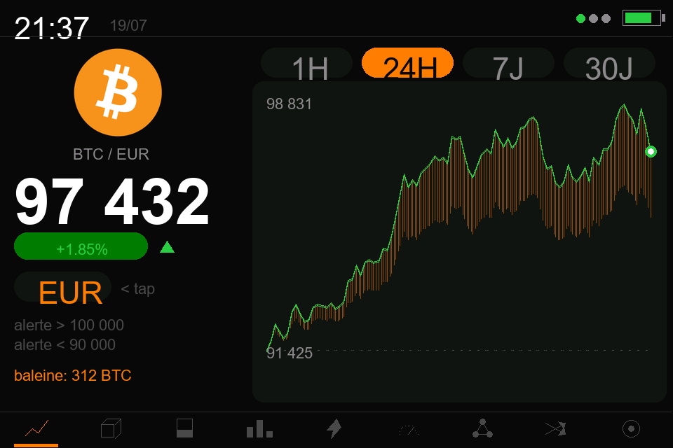 | 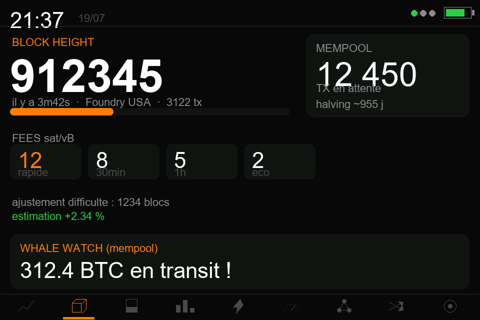 | 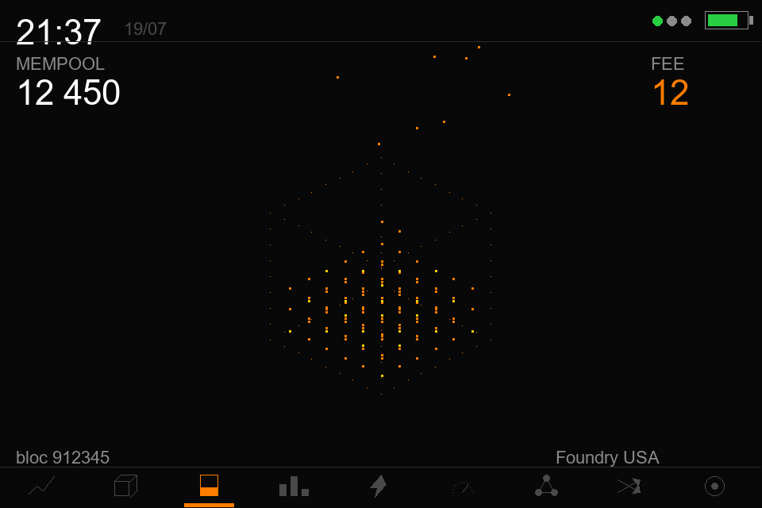 |
| **PRICE** | **ON-CHAIN** | **CUBE** |
| 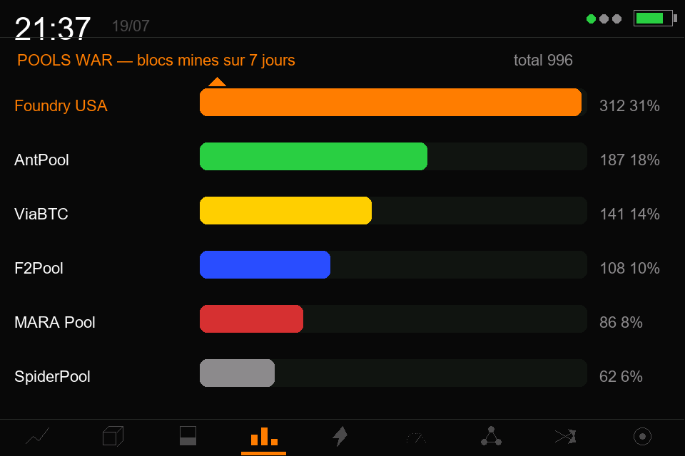 | 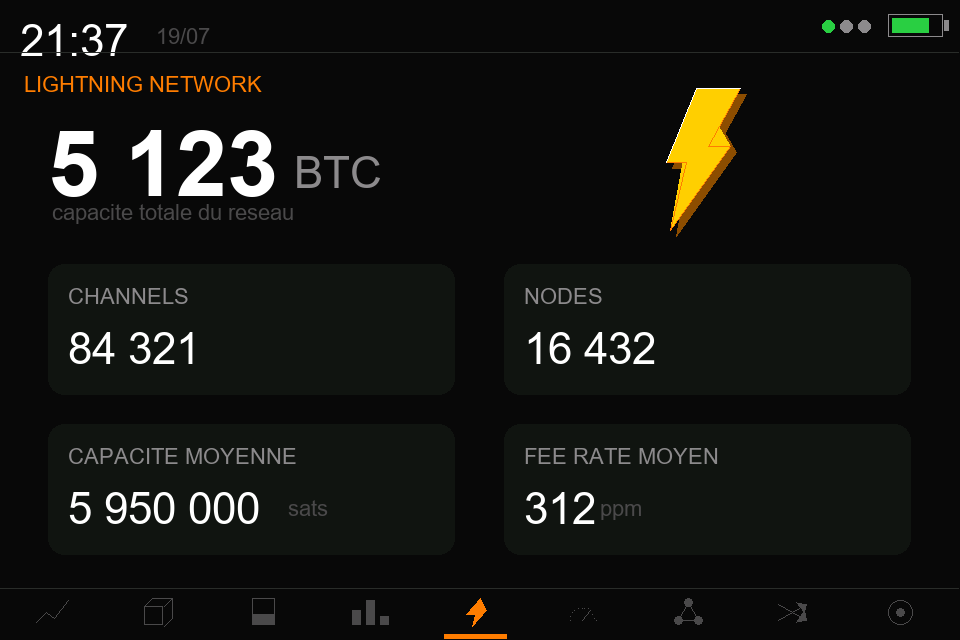 | 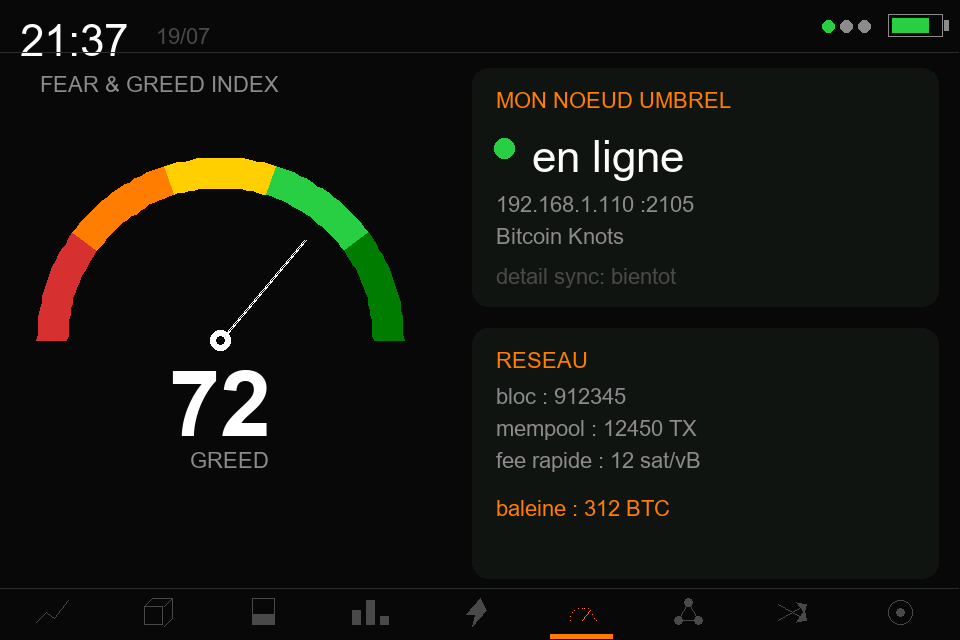 |
| **POOLS WAR** | **LIGHTNING** | **NODE** |
| 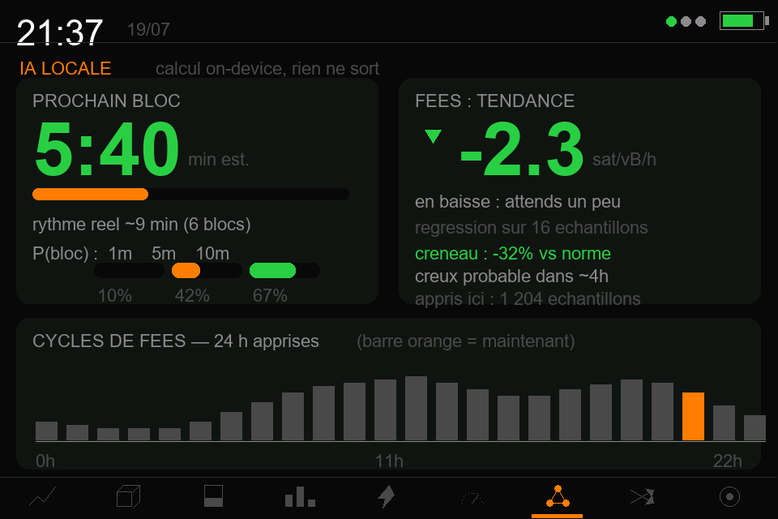 | 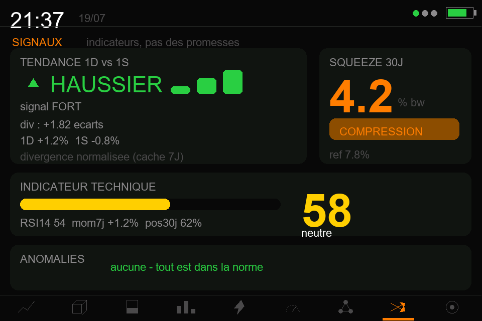 | 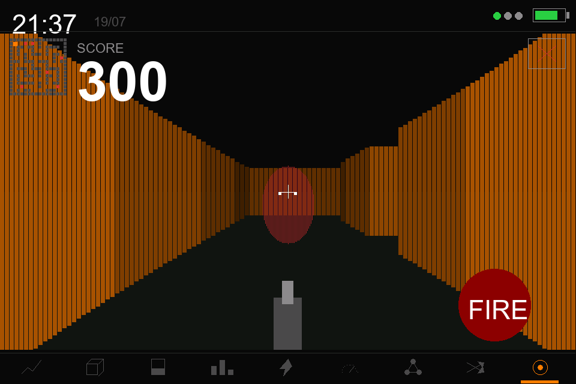 |
| **LOCAL AI** | **SIGNALS** | **BTC DOOM** |

New block flash (all pages except CUBE):


*Mockups generated by [`firmware/tools/mockup_screens.py`](firmware/tools/mockup_screens.py)
— it replays the real drawing functions (same RGB565 palette, same
coordinates, same raycaster) with example data.*

### 🧊 Enclosure (`case/`) — parametric, 3D-printed

| | **v1 — Compact** | **v2 — Deep (~15 cm)** |
|---|---|---|
| Look | Rounded oblong pebble | Mini retro TV / Echo Show wedge |
| Depth | 20 mm | ~147 mm |
| Fits | Board only | Board + speaker + 2000 mAh battery |
| Files | `case/boitier_bitcoinclock.stl` | `case/boitier_deep_avant.stl` + `case/boitier_deep_arriere.stl` |

Both: **12° desk tilt** (stability-checked), board mounted with the **4
original screws** (84.5 × 52.0 mm pattern), **USB-C cutout**, verified
watertight/manifold meshes. Printing & assembly:
**[MANUAL.md](MANUAL.md)** · docs FR: **[README.fr.md](README.fr.md)**

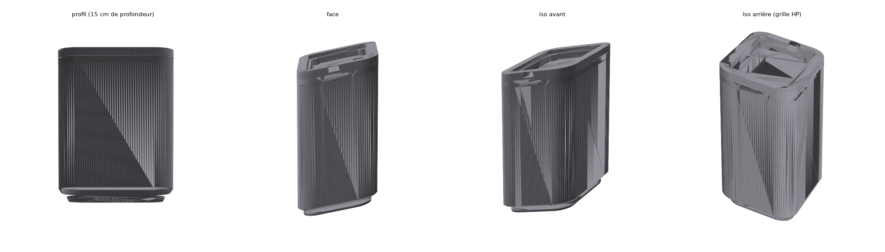

## Hardware

- **Guition JC3248W535**: ESP32-S3 N16R8 (16 MB flash, 8 MB PSRAM OPI),
  3.5" IPS 320×480 AXS15231B (QSPI), capacitive touch (I2C 0x3B), NS4168 I2S
  amp (external speaker on JST), LiPo charge circuit + voltage sense, SD slot
- Optional (v2): small 8 Ω speaker (JST 1.25 2P), LiPo battery up to
  **2000 mAh**


## Build & flash the firmware

Requires: ESP32 Arduino core **2.0.14**, `GFX Library for Arduino`
**v1.4.9 exactly**, ArduinoJson v7, arduino-cli (or Arduino IDE).

```bash
cd firmware/bitcoin-block-clock
# compile
arduino-cli compile --fqbn "esp32:esp32:esp32s3:FlashSize=16M,PSRAM=opi,PartitionScheme=huge_app,CPUFreq=240,USBMode=hwcdc,CDCOnBoot=cdc" .
# upload (adapt the port — then press RESET physically!)
arduino-cli upload --fqbn "esp32:esp32:esp32s3" -p COM42 .
```

First boot: connect to the `BlockClock-Setup` AP (password `12345678`),
enter your WiFi credentials — done. The clock joins your network and gets an
mDNS name: `http://blockclock.local`.

## Repository layout

```
├── firmware/
│   ├── bitcoin-block-clock/      the sketch (Arduino IDE compatible)
│   │   ├── bitcoin-block-clock.ino
│   │   ├── btc_logo.h            RGB565 logo (from CoinGecko asset)
│   │   ├── smooth_font.h         anti-aliased digits (4 bpp alpha)
│   │   ├── trend_model.h         ML experiment — rejected, see notes
│   │   └── btc_logo_src.png
│   ├── tools/                    asset generators (Pillow / sklearn)
│   └── PROJET-NOTES.md           dev documentation (FR)
├── case/                         STLs + parametric Python sources
├── images/                       renders & section views
├── ref/                          manufacturer photos & references
├── MANUAL.md                     end-user manual (print & assembly, EN)
└── README.fr.md                  documentation en français
```

## Credits & references

- Board measurements from manufacturer photos via
  [GthiN89/JC3248W535EN](https://github.com/GthiN89/JC3248W535EN)
- Board info: [atomic14 — Guition JC3248W535](https://www.atomic14.com/esp32/boards/guition-jc3248w535/)
- Community case: [Thingiverse 7127557](https://www.thingiverse.com/thing:7127557)
- APIs: CoinGecko, mempool.space, alternative.me (Fear & Greed)

---

*Bitcoin Block Clock — firmware & enclosure designed by **silexperience**.*
