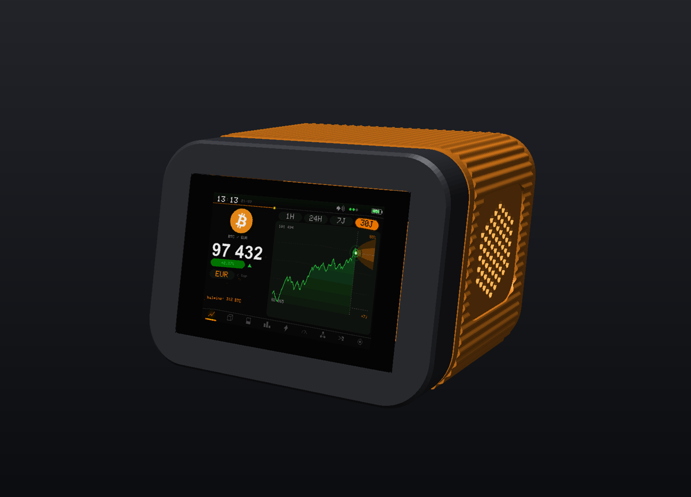
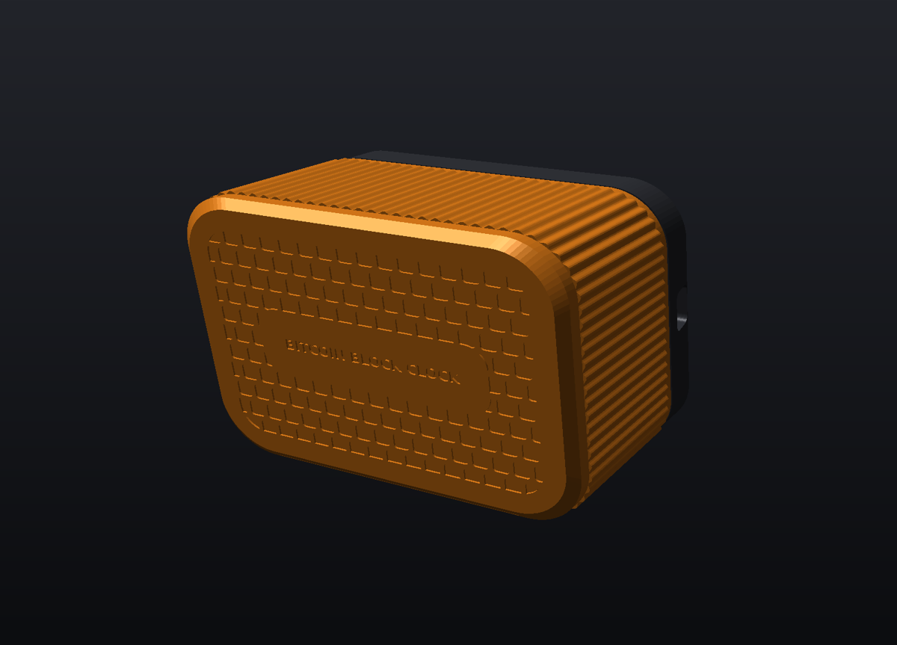
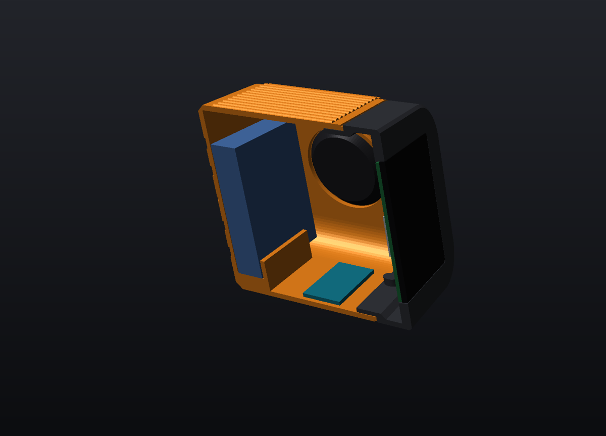
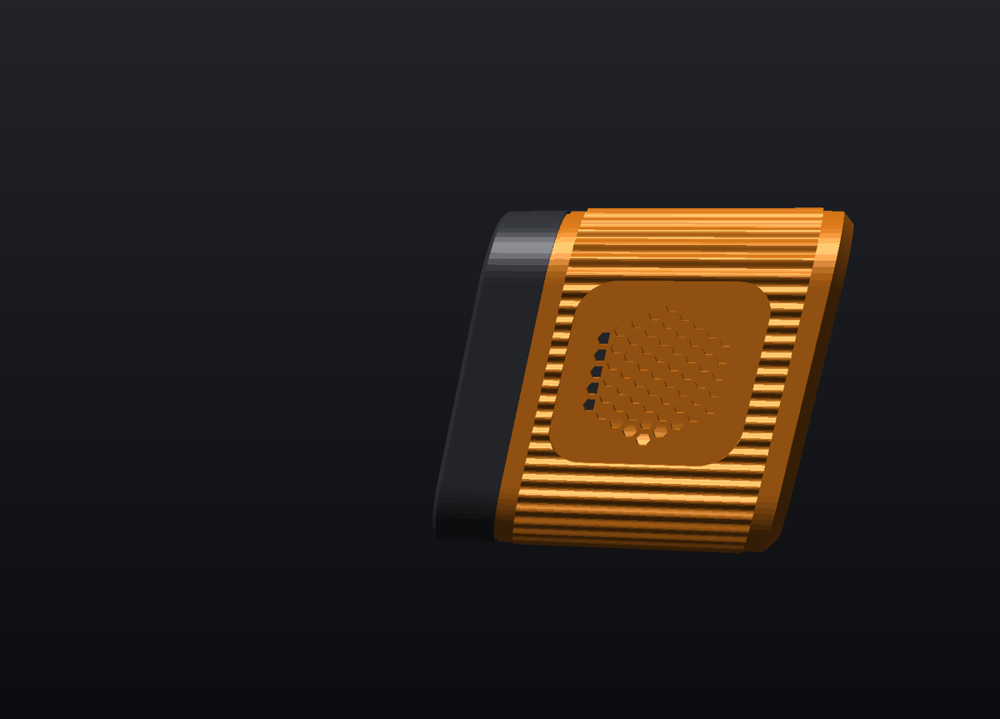
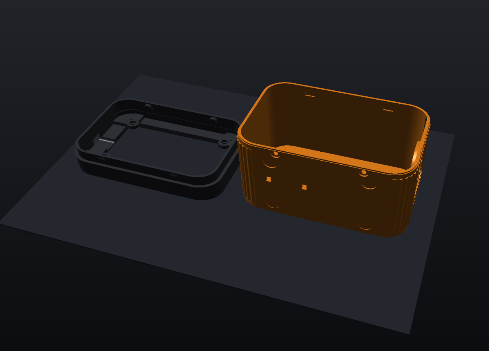

# Boîtier V3 « Flush » — Bitcoin Block Clock

Boîtier entièrement redessiné pour la carte **Guition JC3248W535** (ESP32-S3 + écran 3,5").
Il intègre tous les composants, et **seul l'écran est visible, à fleur de la façade**.
Les formes d'origine sont conservées : façade « squircle », corps incliné à 12°, profil en parallélogramme.

| | |
|---|---|
|  |  |
| Face arrière gravée : motif de blocs + « BITCOIN BLOCK CLOCK » | Coupe : batterie contre la paroi arrière, haut-parleur, carte annexe, module |
|  |  |
| Bande cannelée + grille hexagonale du haut-parleur | Orientation d'impression, sans supports |

## Fichiers

| Fichier | Rôle | Orientation d'impression |
|---|---|---|
| `bbc_v3_jauge_ecran.stl` | **À imprimer en premier** : les 9 premiers mm de la façade, pour valider l'ajustement du module (~40 min) | face avant sur le plateau |
| `bbc_v3_face.stl` | Façade : poche d'écran à fleur, 4 plots de vis, passage USB-C, languette d'assemblage | face avant sur le plateau |
| `bbc_v3_corps.stl` | Corps : bande cannelée, grille haut-parleur, berceau batterie, gravure arrière | face arrière sur le plateau |
| `build_case_v3.py` | Générateur paramétrique (toutes les cotes en tête de fichier) | — |
| `check_fit.py` | Contrôle d'intégration : volumes d'interférence composants / boîtier | — |

**Encombrement :** 124 × 88 mm en façade, environ 88 mm de profondeur.

**Réglages conseillés :**
- PLA ou PETG, couches de 0,2 mm, 3 périmètres, remplissage gyroïde 15 %.
- **Aucun support.** Toutes les parois penchent de 12° au plus, et les ponts font 13 mm au plus.
- Belle bicolore : façade en graphite, corps en orange.

## Nomenclature

- Carte **JC3248W535** avec ses **4 vis d'angle d'origine**.
- **Batterie LiPo 1S 3,7 V ~10 000 mAh, protégée**, 110 × 62 × 12,5 mm maximum, avec connecteur JST 1,25 mm 2 broches (connecteur `BAT` de la carte).
- **Haut-parleur Ø40 mm** (8 Ω, 6 mm d'épaisseur maximum), avec connecteur JST 1,25 mm (connecteur `Speak`).
- En option, une **carte annexe** (Arduino Nano, module chargeur…) jusqu'à environ 45 × 20 × 8 mm. Elle se pose au fond et se fixe avec de l'adhésif mousse ou un collier (2 fentes prévues).
- **2 vis M3 × 8 auto-taraudeuses** pour l'assemblage par le dessous.
- 4 patins caoutchouc Ø10 mm (logements prévus), adhésif double face mousse et colle chaude.

## Montage

1. **Imprime la jauge.** Pose le module dedans, face avant contre le plateau :
   - le verre doit affleurer ;
   - le module doit entrer sans forcer ;
   - une fiche USB-C doit pouvoir se brancher par le flanc gauche.

   Si besoin, ajuste `MOD_CLEAR` (jeu), `MOD_T` (épaisseur verre → dos du PCB), `USB_Y` ou `USB_ZC`, puis relance `python3 build_case_v3.py`.
2. Glisse le module **par l'avant** dans la façade. Visse-le **par l'arrière** avec ses 4 vis d'origine, qui passent dans les plots.
3. Branche le haut-parleur (`Speak`) et la batterie (`BAT`) au dos du module.
4. Colle le haut-parleur dans son anneau (flanc droit, colle chaude). Pose la batterie debout dans son berceau contre la paroi arrière (adhésif mousse). Fixe la carte annexe au fond si tu en as une.
5. Emboîte la façade dans le corps : les 2 crochets du haut s'enclenchent. Visse les 2 vis M3 par le dessous.
6. Branche le câble USB-C par le **flanc gauche**. Le passage accepte les fiches standard, surmoulage de 12,3 × 8,3 mm maximum.

> ⚠️ **Batterie :** utilise une cellule **protégée** de marque et respecte la polarité du connecteur.
> Le chargeur intégré de la carte est dimensionné pour de petites cellules. Une 10 000 mAh se charge donc lentement, et parfois en plus d'une journée.
> Ne laisse pas l'horloge charger sans surveillance les premières fois, et vérifie que la batterie ne chauffe pas.

## Personnaliser

Toutes les cotes sont en tête de `build_case_v3.py` :
- **Enveloppe :** `W`, `H`, `R`, `TOTAL_D`, `TILT`.
- **Textures :** `FLUTE_PITCH` et `FLUTE_A` pour les cannelures ; `BLOCK` et `DEBOSS` pour la gravure.
- **Batterie :** `BAT_*`.
- **Haut-parleur :** `SPK_*`.

Il faut `numpy`, `manifold3d`, `trimesh` et `matplotlib`. `check_fit.py` recalcule les interférences après chaque modification (elles doivent rester à ~0 mm³).

## Licence

**Apache 2.0** — utilisation, modification, impression et revente libres, à
condition de conserver la mention de copyright et l'attribution :
*Bitcoin Block Clock — Copyright 2025-2026 silexperience*, avec un lien vers le
[dépôt d'origine](https://github.com/Silexperience210/bitcoin-block-clock).
Voir [`../LICENSE`](../LICENSE) et [`../THIRD-PARTY.md`](../THIRD-PARTY.md).

## Crédit

Façade « squircle » et inclinaison à 12° : formes d'origine de **nos propres
boîtiers v1/v2** ([`../case`](../case)). Le boîtier communautaire de
[so99hero (Thingiverse 7127557)](https://www.thingiverse.com/thing:7127557),
conservé en référence dans `../ref/case_orig/`, est sous **CC BY-NC-SA** : il
n'est ni repris ni redistribué dans ce dossier.
